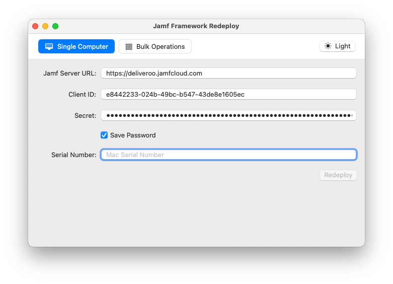
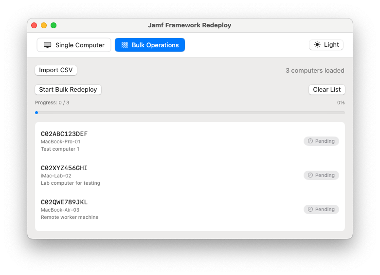

# Jamf-Framework-Redeploy
Fork of the orignal now with added bulk uplaod.

With the release of Jamf Pro 10.36, a new API endpoint was added, which allows you to distribute a QuickAdd.pkg to the macOS client to re-deploy the Jamf Framework. Under the hood, its using the InstallEnterpriseApplication MDM command.

The Jamf Framework Redeploy utility provides both **single computer** and **bulk operations** modes to easily call this API and re-deploy the Jamf Framework for selected computers.

## 🖥️ Interface Modes

### Single Computer Mode
Perfect for deploying to individual machines with real-time feedback.

### Bulk Operations Mode
Efficiently process multiple computers using CSV import with progress tracking.

## 📋 Requirements

- A Mac running macOS Ventura (13.0) or later
- Jamf Pro API Role/Client with the following minimum permissions:
  - Send Computer Remote Command to Install Package
  - Read - Computers
- Jamf Pro Server Settings:
  - Read - Checkin
- The Apple MDM Framework must still be present on the target Mac
- Serial number(s) of the affected Mac(s)

## 📄 CSV File Format

For bulk operations imort a csv.
the CSV can be a simple list of serials no header is required or mutliple columns.
see the exmample CSV files

📥 **[Download Minimal Sample CSV](example%20csv/sample_computers_minmal.csv)**
📥 **[Download Sample CSV](example%20csv/sample_computers.csv)**

## 🚀 Usage

1. **Configure Authentication**:
   - Enter your Jamf Pro server URL
   - Provide your API Client ID and Secret
   - Optionally save credentials to Keychain

2. **Single Computer Mode**:
   - Enter the Mac's serial number
   - Click "Redeploy" to initiate the process

3. **Bulk Operations Mode**:
   - Click "Import CSV" to select your computer list
   - Review the loaded computers
   - Click "Start Bulk Redeploy" to process all computers
   - Monitor progress with the built-in status tracker

## ✅ Success Verification

If successful, you'll see an `InstallEnterpriseApplication` MDM command in the device's management history:

## 📝 Version History

- **v1.2** - Added bulk operations mode, modern macOS UI, dark mode support, and CSV import functionality
- **v1.1** - Authentication now uses API Roles and Clients. Support for basic authentication has been removed.
- **v1.0** - Initial release with single computer deployment capability
